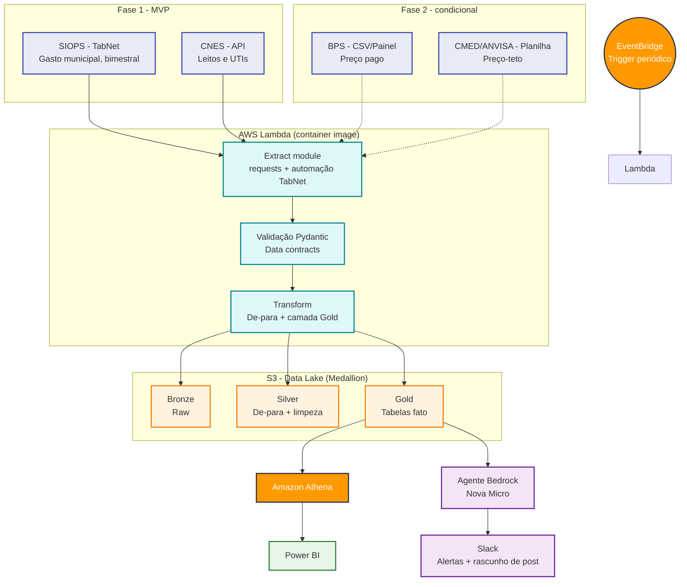

# Observatório de Eficiência do Gasto Público em Saúde


> Pipeline serverless de reconciliação de gasto público, capacidade instalada e (Fase 2) preço de medicamentos no SUS, a partir de fontes públicas oficiais. Todos os dados são reais e públicos. Projeto construído em público (#BuildInPublic), com atualizações no LinkedIn a cada etapa concluída ou estudada.

---

## Navegação

- [Visão geral](#visão-geral)
- [Escopo em duas fases](#escopo-em-duas-fases)
- [Arquitetura](#arquitetura)
- [Fontes de dados](#fontes-de-dados)
- [Modelagem](#modelagem)
- [MDM: onde o problema realmente mora](#mdm-onde-o-problema-realmente-mora)
- [Limitações do índice composto](#limitações-do-índice-composto)
- [Papel do agente de IA](#papel-do-agente-de-ia)
- [Decisões de design aplicadas](#decisões-de-design-aplicadas)
- [Estrutura do projeto](#estrutura-do-projeto)
- [Spikes pendentes](#spikes-pendentes)
- [Status do projeto](#status-do-projeto)
- [Governança e uso responsável de dados públicos](#governança-e-uso-responsável-de-dados-públicos)
- [Acompanhando o progresso](#acompanhando-o-progresso)
- [Autor](#autor)

---

## Visão geral

Este projeto tenta responder a uma pergunta simples: **o dinheiro público em saúde está sendo bem gasto?** Ela é decomposta em três sub-perguntas, cada uma virando uma tabela fato na camada Gold:

1. Quanto o município **gasta** em saúde? (SIOPS)
2. Que **capacidade instalada** isso sustenta? (CNES)
3. Os medicamentos comprados saem a **preço justo**? (BPS × CMED)

As três tabelas fato compartilham `dim_municipio` (código IBGE) e `dim_tempo` — é essa dimensão comum que permite cruzar gasto, capacidade e preço no mesmo recorte geográfico e temporal, em vez de três indicadores isolados que não conversam entre si.

---

## Escopo em duas fases

Projetos de reconciliação de múltiplas fontes públicas tendem a subestimar o tempo de extração e validação — cada fonte tem seu próprio formato, cadência e nível de fricção. Este projeto começa deliberadamente menor, com um MVP que já entrega valor sozinho, em vez de tentar as quatro fontes de uma vez.

**Fase 1 — MVP: "gasto × capacidade instalada"**
Fontes: SIOPS + CNES. Entrega `fato_gasto_saude` e `fato_capacidade_instalada`. Responde metade da pergunta original com formatos de dado mais previsíveis, sem depender do matching mais difícil (item↔item de medicamentos). Marco publicável: dashboard Power BI de gasto per capita × leitos/UTI por município.

**Fase 2 — condicional: "preço justo" (BPS × CMED)**
Só avança se o spike de cobertura do de-para item↔item (ver [MDM](#mdm-onde-o-problema-realmente-mora)) for satisfatório. Se a cobertura for baixa, a fonte entra no projeto como **opcional**: sua ausência ou falha não aciona os circuit breakers nem interrompe as demais fontes — degrada sem derrubar o pipeline.

---

## Arquitetura

Compute planejado como **AWS Lambda (container image)** — o pipeline roda poucas vezes por período, o que não justifica um cluster always-on. Lambda fora de VPC também evita o custo de NAT Gateway.



**Stack planejada:**

| Componente | Serviço | Status |
|---|---|---|
| Orquestração | Amazon EventBridge → AWS Lambda | Planejado |
| Processamento | AWS Lambda, container image | Planejado |
| Data lake | S3, camadas bronze/silver/gold | Planejado |
| Consulta | Amazon Athena | Planejado |
| IA | Amazon Bedrock (Nova Micro ou equivalente de baixo custo) | Planejado, dentro do orçamento de free tier de conta nova |
| Observabilidade | Slack (webhook) | Planejado |
| IaC | AWS SAM (`template.yaml`) | Esqueleto criado |

---

## Fontes de dados

| Fonte | O que fornece | Cadência | Formato de acesso | Fase | Fricção conhecida |
|---|---|---|---|---|---|
| SIOPS | Execução orçamentária em saúde por município | Bimestral | TabNet — consulta parametrizada, **sem API REST** | 1 | Autodeclarado; inconsistência histórica de preenchimento entre municípios |
| CNES | Leitos e UTIs por estabelecimento/município | Contínua | API pública | 1 | A confirmar em spike |
| IBGE/SIDRA | População residente estimada por município | Anual | API pública | 1 | Tabela de apoio (`dim_populacao_municipio`), não fato — denominador do per capita |
| BPS | Preço efetivamente pago em compras públicas | Contínua | CSV/XML (bases anuais) + Painel | 2 | Chave de item = Código BR/CATMAT |
| CMED (ANVISA) | Preço-teto regulado de medicamentos | Periódica | Planilha/PDF | 2 | Chave de item = registro Anvisa/apresentação; formatação suja (ponto × vírgula, asteriscos) |

---

## Modelagem

Camada Gold planejada, todas as tabelas ancoradas em `dim_municipio` (código IBGE) e `dim_tempo`:

- **`fato_gasto_saude`** (Fase 1) — despesa total em saúde por município/bimestre (SIOPS).
- **`fato_capacidade_instalada`** (Fase 1) — leitos e UTIs por município/competência (CNES).
- **`dim_populacao_municipio`** (Fase 1) — população residente estimada por município/ano (IBGE/SIDRA). Não é fato, é a tabela de apoio sem a qual o "per capita" do marco publicável não existe — adicionada depois de uma revisão que identificou a ausência.
- **`fato_precos_medicamentos`** (Fase 2, condicional) — preço pago × preço regulado por item/comprador/período (BPS × CMED).

Gasto per capita e leitos por habitante são calculados via `JOIN` no Athena entre as tabelas fato e `dim_populacao_municipio`, não como coluna física nas fatos — evita acoplar o fato a uma revisão futura da estimativa populacional.

---

## MDM: onde o problema realmente mora

Correção importante em relação ao desenho inicial: o cruzamento frágil **não é instituição↔município** — o BPS parece já expor município como dimensão direta de consulta, com CNPJ do comprador. O cruzamento frágil de verdade é **item↔item entre BPS e CMED**, porque cada fonte identifica o medicamento por uma chave diferente (Código BR/CATMAT vs. registro Anvisa/apresentação).

Isso vai exigir uma tabela de referência própria (`src/reference/catmat_registro_anvisa_map.csv`), com alerta de cobertura logado a cada execução — nunca falha silenciosa: item sem correspondência é registrado explicitamente, não descartado sem rastro.

---

## Limitações do índice composto

Está prevista uma métrica de eficiência combinando gasto, capacidade e preço por município. Esse indicador carrega risco reputacional real — é dado de gestão pública, não commodity. Sempre que publicado, deve vir acompanhado do aviso de que:

- não normaliza por perfil populacional nem complexidade da rede;
- não corrige efeito de município-polo (atende população vizinha, distorcendo a relação gasto/capacidade local);
- é uma **hipótese de pesquisa exploratória**, não uma auditoria oficial.

O objetivo é deixar explícito, sempre junto do número, o que ele mede e o que ele não mede.

---

## Papel do agente de IA

- **Modelo:** Amazon Nova Micro (ou equivalente de baixo custo) via Bedrock, dentro dos créditos de free tier de conta nova AWS — validar limites atuais em [aws.amazon.com/free](https://aws.amazon.com/free) antes de comprometer a arquitetura, pois esses termos mudam com frequência.
- **Função:** ler a camada Gold já validada e escrever um resumo em linguagem natural apontando outliers. Não gera dado novo — só interpreta o que já passou pelo circuit breaker.
- **Governança:** o agente **nunca posta sozinho**. Escreve rascunho, envia pro Slack, humano revisa e publica no LinkedIn com a própria voz.

---

## Decisões de design aplicadas

> **Lambda "Master" única, não Step Functions** — para a Fase 1 (duas fontes sequenciais, execução mensal/bimestral, volume pequeno), uma Lambda orquestrando internamente extract → validate → transform → load é mais simples de operar e depurar do que uma state machine. `lambda_function.py` é uma casca fina que chama `orchestrator.run()` — mesmo pipeline local e em produção. Reavaliar Step Functions se a Fase 2 precisar de ramos paralelos com retry independente (ex.: extrair BPS e CMED em paralelo antes do join item↔item).

> **Circuit breaker simples no MVP, duplo já preparado para o SIOPS** — `check_coverage` (taxa de rejeição por linha) roda para todas as fontes desde já. Um segundo critério, `check_agregado_siops` (cobertura de valor agregado contra um total declarado no período), já existe no código mas só entra em produção quando o spike do SIOPS confirmar um total agregado confiável exposto pelo próprio TabNet para comparar. Ativar o critério antes disso criaria falso positivo/negativo em vez de proteger o pipeline.

> **`src/agents/` separado de `src/utils/notifier.py`** — construção de prompt e chamada ao modelo (o que muda se o modelo/provider mudar) fica isolada da entrega da mensagem (Slack, que não sabe nada sobre LLM). O agente lê apenas dado já validado pela Gold e sua saída é sempre rascunho — nunca publica sozinho.

> **Lógica de carga dentro de `src/utils/storage.py`, sem `src/loaders/` por enquanto** — no escopo da Fase 1 (2 tabelas fato), particionamento e escrita em Parquet são simples o suficiente para caber no conector existente. Reavaliar um pacote de loaders dedicado se a Fase 2 aumentar a complexidade de particionamento.

> **`dim_populacao_municipio` como tabela de apoio, não fato** — população entra na Fase 1 porque o marco publicável (gasto per capita) depende dela, mas fica fora do `JOIN` físico das fatos para não acoplar a granularidade do fato a uma revisão futura da estimativa populacional.

---

## Estrutura do projeto

```bash
saude-publica-data-product/
├── lambda_function.py           # Entrypoint de produção (AWS Lambda)
├── orchestrator.py              # Entrypoint de execução manual/local
├── src/
│   ├── extractors/
│   │   ├── siops_extractor.py       # Fase 1
│   │   ├── cnes_extractor.py        # Fase 1
│   │   ├── populacao_extractor.py   # Fase 1 (IBGE/SIDRA — denominador do per capita)
│   │   ├── bps_extractor.py         # Fase 2 (stub, condicional)
│   │   └── cmed_extractor.py        # Fase 2 (stub, condicional)
│   ├── transformers/
│   │   ├── siops_cleaner.py
│   │   ├── cnes_cleaner.py
│   │   └── gold_builder.py
│   ├── models/
│   │   └── contracts.py             # Contratos Pydantic, com validators (ex.: leitos_uti <= leitos_total)
│   ├── reference/
│   │   └── README.md                # catmat_registro_anvisa_map.csv nasce aqui na Fase 2
│   ├── agents/
│   │   └── bedrock_agent.py         # Prompt + chamada ao modelo, separado da entrega (notifier)
│   └── utils/
│       ├── date_rules.py
│       ├── quarantine.py            # Circuit breaker — critério 1 (rejeição) + critério 2 pronto p/ SIOPS
│       ├── storage.py               # DataLakeConnector (S3/local)
│       └── notifier.py              # Entrega no Slack, sempre marcando rascunho do agente
├── tests/
│   ├── test_contracts.py
│   ├── test_extractors.py           # stub — mocks a preencher após os spikes
│   └── test_transformers.py         # stub — mocks a preencher após os spikes
├── docs/
│   ├── DOCUMENTACAO_TECNICA.md      # Spikes, runbook, decisões
│   └── sql/
│       └── athena_ddl.sql
├── Dockerfile
├── template.yaml
├── .gitignore
├── LICENSE
└── requirements.txt
```

---

## Spikes pendentes

Antes de sair do esqueleto e implementar os extratores de verdade, dois spikes de 1 dia cada:

1. **Spike CNES** — confirmar endpoint estável de API, paginação e taxa de requisição segura.
2. **Spike SIOPS** — mapear o fluxo real do TabNet (parâmetros de consulta, formato de exportação) e decidir estratégia de extração (provável automação de formulário, não `requests` puro).

Um terceiro spike decide o go/no-go da Fase 2 (cobertura do de-para BPS × CMED). Detalhes em [`docs/DOCUMENTACAO_TECNICA.md`](./docs/DOCUMENTACAO_TECNICA.md).

---

## Status do projeto

| Fase | Status |
|---|---|
| 0 — Definição de escopo e arquitetura | Concluída |
| 1 — Spikes (CNES, SIOPS) | Pendente |
| 2 — Contratos de dados + extração (Fase 1) | Não iniciada |
| 3 — Silver + Gold (Fase 1) | Não iniciada |
| 4 — Athena + Power BI (Fase 1) | Não iniciada — primeiro marco publicável |
| 5 — Decisão go/no-go Fase 2 (spike BPS) | Não iniciada |
| 6 — Extração + de-para BPS × CMED (se for go) | Condicional |
| 7 — Agente Bedrock | Não iniciada |

Sem datas prometidas — atualização no LinkedIn a cada etapa concluída ou estudada.

---

## Governança e uso responsável de dados públicos

- Respeito ao `robots.txt` e termos de uso de cada fonte.
- Rate limiting explícito entre requisições.
- Retries com backoff (Tenacity), não repetição imediata em erro.
- Nenhuma técnica de evasão de proteção anti-bot — coleta transparente e auditável.
- Indicadores derivados (índice composto) sempre publicados com as limitações metodológicas explícitas — ver [Limitações do índice composto](#limitações-do-índice-composto).

---

## Acompanhando o progresso

Projeto construído em público, com atualizações regulares no LinkedIn a cada fase concluída.

- LinkedIn: [linkedin.com/in/magalhaes-vitor](https://www.linkedin.com/in/magalhaes-vitor/)

---

## Autor

**Vitor De Toledo Magalhães**
Desenvolvedor Python | Especialista em Automação (RPA) | Engenharia de Dados Cloud

- LinkedIn: [linkedin.com/in/magalhaes-vitor](https://www.linkedin.com/in/magalhaes-vitor/)
- GitHub: [github.com/Magalhaes-vitor](https://github.com/Magalhaes-vitor)
